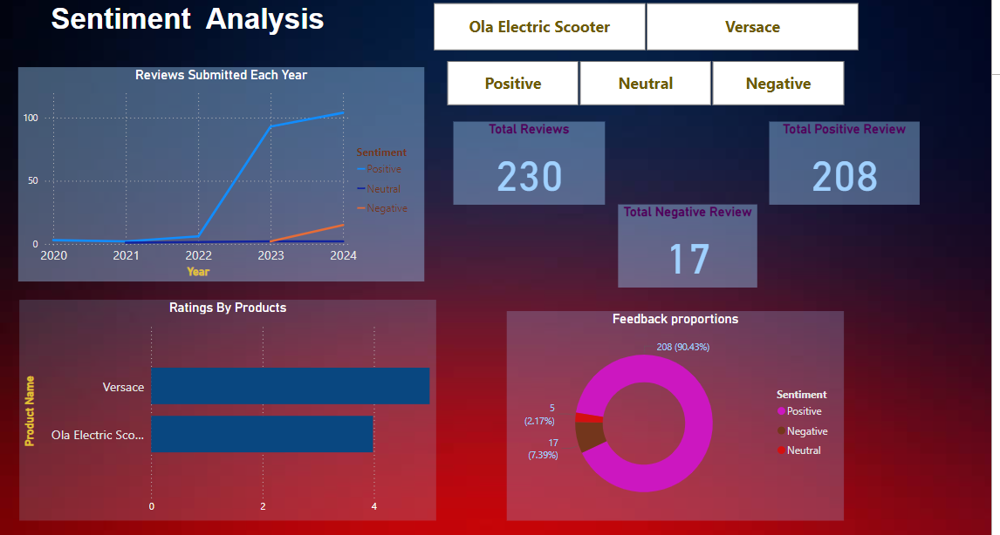

### Project Overview
This project analyzes customer sentiment for products by web scraping reviews, performing sentiment analysis, and visualizing results.

### Tools and Libraries
- Python: Used for web scraping, text cleaning, and sentiment analysis.
- Libraries: pandas, BeautifulSoup, regex, TextBlob.
- Power BI: For visualizing sentiment trends and average ratings.

### Key Tasks
1. Data Collection: Scraped reviews, ratings, and metadata using BeautifulSoup.
2. Data Cleaning: Cleaned text data (removed stopwords, applied stemming) with regex and pandas.
3. Sentiment Analysis: Used TextBlob to classify reviews as positive, negative, or neutral.
4. Visualization: Created Power BI visuals to analyze trends in sentiment over time.

Power BI Visualization

